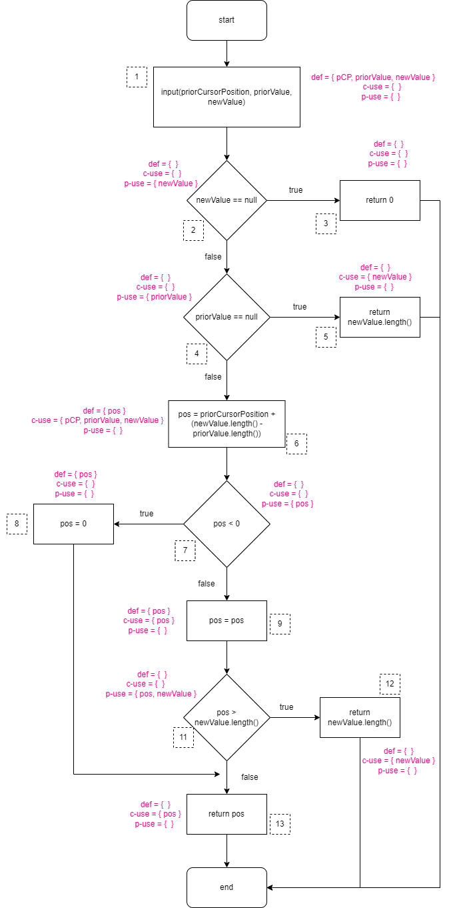
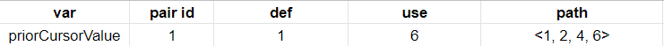
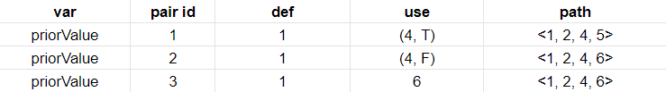
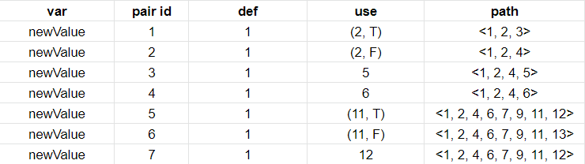
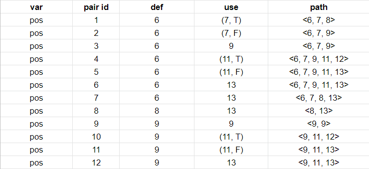
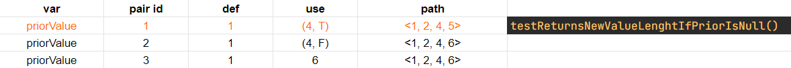
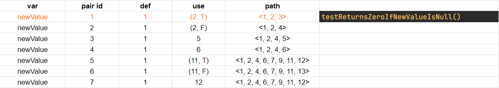
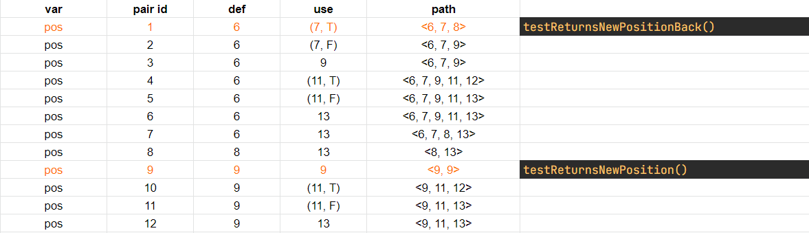
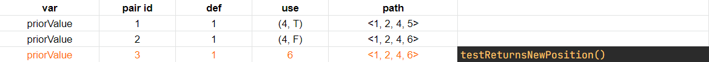
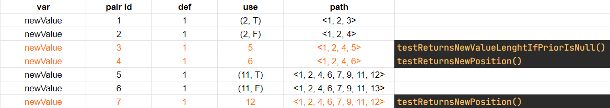

# Report - Assignment #08

> **Anastasiia Dunaeva** - up202202453
>
> **Lucas Silva** - up202103397
>
> **Francisco Pacheco** - up201906505

## Which functions have you selected for testing and why.

### Function 1

- description

### Function 2

- description

### Function 3

- description

## What is the purpose of each function.

### Function 1

- description

### Function 2

- description

### Function 3

- description

## Step-by-step of the ‘Dataflow Testing’ for each function and each variable.

> We are interesting in seeing a tabular

### Function 1

- Constructed control-flow graph
- Defined defs, c-uses and p-uses for each block
- Attached defs, c-use and p-use to each node in the graph

_priorCursorPosition_ was shortened to "pCP" for convenience.
- Created tabular summary for each variable (see it below)
- Specify all-defs, all-c-uses, all-p-uses, all-uses pairs (see it below)
- Created tests to cover all needed paths

### Function 2

- description

### Function 3

- description

## Summary for each variable

> as the one presented in lecture #9 and all paths for each coverage criteria: all-defs,

### Function 1
We collected all def-use pairs for all variables by control-flow graph. 

### Function 2

- description

### Function 3

- description

## all-defs, all-c-uses, all-p-uses, and all-uses.

### Function 1
- all-defs
  - for every function variable v at least one def-clear path from every definition of v to at least one c-use or one p-use of v must be covered

- all-c-uses
  - for every function variable v at least one def-clear path from every definition of v to every c-use of v must be covered

- all-p-uses
  - for every function variable v at least one def-clear path from every definition of v to every p-use of v must be covered
- all-uses
  - for every function variable v at least one def-clear path from every definition of v to every c-use and every p-use of v must be covered

### Function 2

- all-defs
  - description
- all-c-uses
  - description
- all-p-uses
  - description
- all-uses
  - description

### Function 3

- all-defs
  - description
- all-c-uses
  - description
- all-p-uses
  - description
- all-uses
  - description

## Brief description of the unit tests generated for each coverage criteria.

### Function 1

| Unit test | Coverage Criteria |
| --------- | ----------------- |
| t1        | description       |

### Function 2

| Unit test | Coverage Criteria |
| --------- | ----------------- |
| t1        | description       |

### Function 3

| Unit test | Coverage Criteria |
| --------- | ----------------- |
| t1        | description       |

## Brief description of the outcome of each unit test and whether any test results in a failure (and why).

### Function 1

| Unit test | VariableX | VariableY | Outcome             | Failure reason |
| --------- | --------- | --------- | ------------------- | -------------- |
| t1        | 0         | 1         | outcome description | description    |
| t2        | 1         | 2         | outcome description | -              |

### Function 2

| Unit test | VariableX | VariableY | Outcome             | Failure reason |
| --------- | --------- | --------- | ------------------- | -------------- |
| t1        | 0         | 1         | outcome description | description    |
| t2        | 1         | 2         | outcome description | -              |

### Function 3

| Unit test | VariableX | VariableY | Outcome             | Failure reason |
| --------- | --------- | --------- | ------------------- | -------------- |
| t1        | 0         | 1         | outcome description | description    |
| t2        | 1         | 2         | outcome description | -              |
