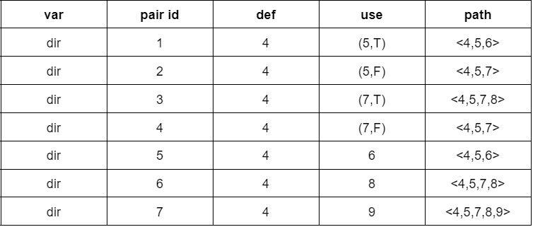

# Report - Assignment #08

> **Anastasiia Dunaeva** - up202202453
>
> **Lucas Silva** - up202103397
>
> **Francisco Pacheco** - up201906505

## Which functions have you selected for testing and why.

### Function 1

```java
public static final int calculate(int priorCursorPosition, String priorValue, String newValue)
```

- The function was chosen because it has a sufficient number of variables and it has several branches in the control-flow graph.

### Function 2

```java
public static String insertPadded​(String s, int insertAt, String stringToInsert)
```

- This function was chosen because of its different number of arguments and types, and the ways that is possible to perform different kind of executions helping with the data flow testing.

### Function 3

```java
public static void createParentDirectory(File dest)
```

- This function was chosen because it's behavior and goal it's different that the functions chosen before and also it origins a good data flow diagram for analysis. 

## What is the purpose of each function.

### Function 1

- Function calculates the cursor position based on initial cursor position (_priorCursorPosition_), old string value (_priorValue_) and new string value (_newValue_).

### Function 2

- This function inserts a given string into another padding it with spaces. Is aware if the insertion point has a space on either end and does not add extra spaces.
- Parameters:
  - s - the string to insert into
  - insertAt - the position to insert the string
  - stringToInsert - the string to insert
- Returns:
  - the result of inserting the stringToInsert into the passed in string
- Throws:
  - `IndexOutOfBoundsException` - if the insertAt is negative, or insertAt is larger than the length of s String object

### Function 3

- This funtion creates the parent directory for a file.
- Parameters:
  - file - The file which parent directory will be created.
- Throws: 
  - `IndexOutOfBoundsException` - if the file received doesn't exist or the function wasn't able to create the parent directory.

## Step-by-step of the ‘Dataflow Testing’ for each function and each variable.

> We are interesting in seeing a tabular

### Function 1

- Constructed control-flow graph
- Defined defs, c-uses and p-uses for each block
- Attached defs, c-use and p-use to each node in the graph
  
  <br>_priorCursorPosition_ was shortened to "pCP" for convenience.</br>
- Created tabular summary for each variable (see it below)
- Specify all-defs, all-c-uses, all-p-uses, all-uses pairs (see it below)
- Created tests to cover all needed paths

### Function 2

- Constructed control-flow graph for _insertPadded_ function
- Defined defs, c-uses and p-uses for each block
- Attached defs, c-use and p-use to each node in the graph


- Specify all-defs, all-c-uses, all-p-uses, all-uses pairs (see it below)

### Function 3

- Constructed control-flow graph for _insertPadded_ function
- Defined defs, c-uses and p-uses for each block
- Attached defs, c-use and p-use to each node in the graph


- Specify all-defs, all-c-uses, all-p-uses, all-uses pairs (see it below)

## Summary for each variable

> as the one presented in lecture #9 and all paths for each coverage criteria: all-defs,

### Function 1

We collected all def-use pairs for all variables by control-flow graph.


### Function 2

- description

### Function 3

We collected all def-use pairs for all variables by control-flow graph.




## all-defs, all-c-uses, all-p-uses, and all-uses.

### Function 1

- On the right column a test which cover needed path is specified.
- all-defs
  - for every function variable v at least one def-clear path from every definition of v to at least one c-use or one p-use of v must be covered
    
    
    
    
- all-c-uses
  - for every function variable v at least one def-clear path from every definition of v to every c-use of v must be covered
    
    
    
    
- all-p-uses
  - for every function variable v at least one def-clear path from every definition of v to every p-use of v must be covered
  - _priorCursorPosition_ doesn't have p-uses.
  - Pair which colored as blue can't be covered by def-clear path.
    
    
    
- all-uses
  - for every function variable v at least one def-clear path from every definition of v to every c-use and every p-use of v must be covered
  - Pair which colored as blue can't be covered by def-clear path.
    
    
    
    

### Function 2

- all-defs
  - description
- all-c-uses
  - description
- all-p-uses
  - description
- all-uses
  - description

### Function 3

- all-defs
  - description
- all-c-uses
  - description
- all-p-uses
  - description
- all-uses
  - description

## Brief description of the unit tests generated for each coverage criteria.

### Function 1

| Unit test                                | Coverage Criteria                                                           |
|------------------------------------------|-----------------------------------------------------------------------------|
| testReturnsZeroIfNewValueIsNull()        | The corresponding coverage criteria can be determined from the tables above |
| testReturnsNewValueLengthIfPriorIsNull() | The corresponding coverage criteria can be determined from the tables above |
| testReturnsNewPosition()                 | The corresponding coverage criteria can be determined from the tables above |
| testReturnsNewPositionLongerString()     | The corresponding coverage criteria can be determined from the tables above |
| testReturnsNewPositionBack()             | The corresponding coverage criteria can be determined from the tables above |

### Function 2

| Unit test | Coverage Criteria |
| --------- | ----------------- |
| t1        | description       |
| t1        | description       |

### Function 3

| Unit test | Coverage Criteria |
| --------- | ----------------- |
| t1        | description       |

## Brief description of the outcome of each unit test and whether any test results in a failure (and why).

### Function 1

| Unit test                                | priorCursorPosition | priorValue  | newValue    | Outcome | Failure reason |
| ---------------------------------------- | ------------------- | ----------- | ----------- | ------- | -------------- |
| testReturnsZeroIfNewValueIsNull()        | 0                   | null        | null        | 0       | -              |
| testReturnsNewValueLengthIfPriorIsNull() | 0                   | null        | "New Value" | 9       | -              |
| testReturnsNewPosition()                 | 10                  | "Old Value" | "New Value" | 9       | -              |
| testReturnsNewPositionLongerString()     | 6                   | "Old Value" | "New Value" | 6       | -              |
| testReturnsNewPositionBack()             | 1                   | "Old Value" | "New"       | 0       | -              |

### Function 2

| Unit test | VariableX | VariableY | Outcome             | Failure reason |
| --------- | --------- | --------- | ------------------- | -------------- |
| t1        | 0         | 1         | outcome description | description    |
| t2        | 1         | 2         | outcome description | -              |

### Function 3

| Unit test | VariableX | VariableY | Outcome             | Failure reason |
| --------- | --------- | --------- | ------------------- | -------------- |
| t1        | 0         | 1         | outcome description | description    |
| t2        | 1         | 2         | outcome description | -              |
