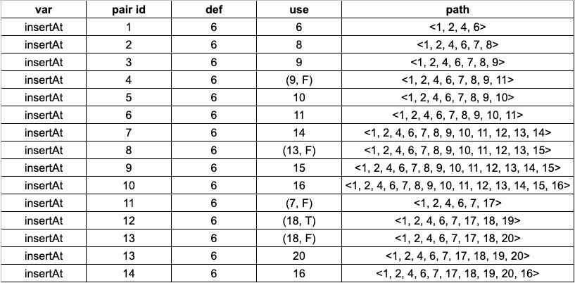
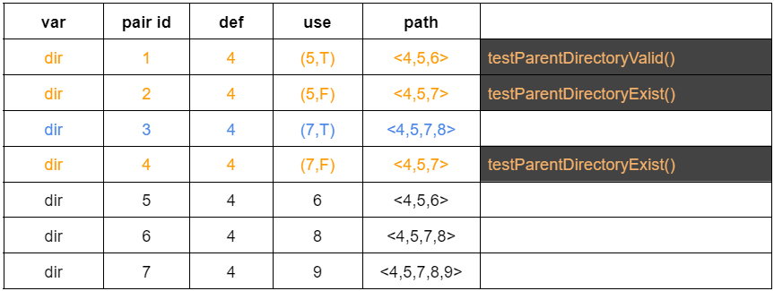
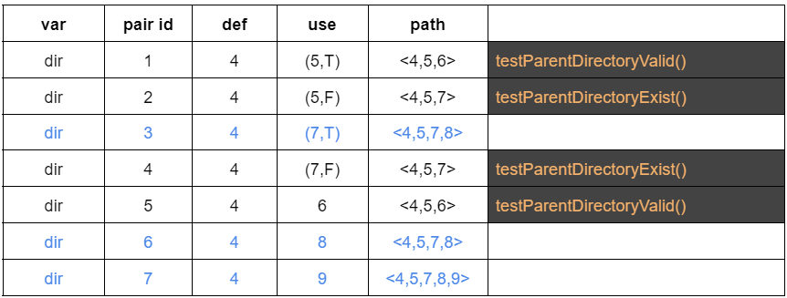

# Report - Assignment #08

> **Anastasiia Dunaeva** - up202202453
>
> **Lucas Silva** - up202103397
>
> **Francisco Pacheco** - up201906505
> `

## Which functions have you selected for testing and why.

### Function 1

```java
public static final int calculate(int priorCursorPosition, String priorValue, String newValue)
```

- The function was chosen because it has a sufficient number of variables and it has several branches in the control-flow graph.

### Function 2

```java
public static String insertPadded​(String s, int insertAt, String stringToInsert)
```

- This function was chosen because of its different number of arguments and types, and the ways that is possible to perform different kind of executions helping with the data flow testing.

### Function 3

```java
public static void createParentDirectory(File dest)
```

- This function was chosen because it's behavior and goal it's different that the functions chosen before and also it origins a good data flow diagram for analysis.

## What is the purpose of each function.

### Function 1

- Function calculates the cursor position based on initial cursor position (_priorCursorPosition_), old string value (_priorValue_) and new string value (_newValue_).

### Function 2

- This function inserts a given string into another padding it with spaces. Is aware if the insertion point has a space on either end and does not add extra spaces.
- Parameters:
  - s - the string to insert into
  - insertAt - the position to insert the string
  - stringToInsert - the string to insert
- Returns:
  - the result of inserting the stringToInsert into the passed in string
- Throws:
  - `IndexOutOfBoundsException` - if the insertAt is negative, or insertAt is larger than the length of s String object

### Function 3

- This funtion creates the parent directory for a file.
- Parameters:
  - file - The file which parent directory will be created.
- Throws:
  - `IndexOutOfBoundsException` - if the file received doesn't exist or the function wasn't able to create the parent directory.

## Step-by-step of the ‘Dataflow Testing’ for each function and each variable.

> We are interesting in seeing a tabular

### Function 1

- Constructed control-flow graph
- Defined defs, c-uses and p-uses for each block
- Attached defs, c-use and p-use to each node in the graph
  
  <br>_priorCursorPosition_ was shortened to "pCP" for convenience.</br>
- Created tabular summary for each variable (see it below)
- Specify all-defs, all-c-uses, all-p-uses, all-uses pairs (see it below)
- Created tests to cover all needed paths

### Function 2

- Constructed control-flow graph for _insertPadded_ function
- Defined defs, c-uses and p-uses for each block
- Attached defs, c-use and p-use to each node in the graph


- Specify all-defs, all-c-uses, all-p-uses, all-uses pairs (see it below)

### Function 3

- Constructed control-flow graph for _insertPadded_ function
- Defined defs, c-uses and p-uses for each block
- Attached defs, c-use and p-use to each node in the graph


- Specify all-defs, all-c-uses, all-p-uses, all-uses pairs (see it below)

## Summary for each variable

> as the one presented in lecture #9 and all paths for each coverage criteria: all-defs,

### Function 1

We collected all def-use pairs for all variables by control-flow graph.


### Function 2

We collected all def-use pairs for all variables by control-flow graph.





### Function 3

We collected all def-use pairs for all variables by control-flow graph.


## all-defs, all-c-uses, all-p-uses, and all-uses.

### Function 1

- On the right column a test which cover needed path is specified.
- all-defs
  - for every function variable v at least one def-clear path from every definition of v to at least one c-use or one p-use of v must be covered
    
    
    
    
- all-c-uses
  - for every function variable v at least one def-clear path from every definition of v to every c-use of v must be covered
    
    
    
    
- all-p-uses
  - for every function variable v at least one def-clear path from every definition of v to every p-use of v must be covered
  - _priorCursorPosition_ doesn't have p-uses.
  - Pair which colored as blue can't be covered by def-clear path.
    
    
    
- all-uses
  - for every function variable v at least one def-clear path from every definition of v to every c-use and every p-use of v must be covered
  - Pair which colored as blue can't be covered by def-clear path.
    
    
    
    

### Function 2

- all-defs

  - for every function variable v at least one def-clear path from every definition of v to at least one c-use or one p-use of v must be covered

  | var            | pair id | def | use    | path                                  | test case         |
  | -------------- | ------- | --- | ------ | ------------------------------------- | ----------------- |
  | s              | 1       | 1   | (2, T) | <1, 2, 3>                             | insertPaddedE1()  |
  | insertAt       | 1       | 1   | (4, T) | <1, 2, 4, 5>                          | insertPaddedE6()  |
  | stringToInsert | 1       | 1   | (2, T) | <1, 2, 3>                             | insertPaddedE8()  |
  | newText        | 1       | 6   | 6      | <1, 2, 3, 4, 6>                       | insertPaddedE10() |
  | posItem        | 1       | 12  | 13     | <1, 2, 4, 6, 7, 8, 9, 10, 11, 12, 13> | insertPaddedE11() |

- all-c-uses

  - for every function variable v at least one def-clear path from every definition of v to every c-use of v must be covered

  | var            | pair id | def | use     | path                                              | test case         |
  | -------------- | ------- | --- | ------- | ------------------------------------------------- | ----------------- |
  | s              | 1       | 1   | (2, T)  | <1, 2, 3>                                         | insertPaddedE1()  |
  | s              | 2       | 1   | (4, T)  | <1, 2, 4, 5>                                      | insertPaddedE1()  |
  | s              | 3       | 1   | 8       | <1, 2, 4, 6, 7, 8>                                | insertPaddedE2()  |
  | s              | 4       | 1   | (9, F)  | <1, 2, 4, 6, 7, 8, 9, 11, 12>                     | insertPaddedE3()  |
  | s              | 5       | 1   | (9, T)  | <1, 2, 4, 6, 7, 8, 9, 10, 11, 12>                 | insertPaddedE3()  |
  | s              | 6       | 1   | (13, F) | <1, 2, 4, 6, 7, 8, 9, 10, 11, 12, 13, 15>         | insertPaddedE3()  |
  | s              | 7       | 1   | (13, T) | <1, 2, 4, 6, 7, 8, 9, 10, 11, 12, 13, 14, 15>     | insertPaddedE3()  |
  | s              | 8       | 1   | (7, F)  | <1, 2, 4, 6, 7, 17, 18>                           | insertPaddedE5()  |
  | s              | 9       | 1   | (18, F) | <1, 2, 4, 6, 7, 17, 18, 20>                       | insertPaddedE4()  |
  | s              | 10      | 1   | (18, T) | <1, 2, 4, 6, 7, 17, 18, 19, 20>                   | insertPaddedE4()  |
  | insertAt       | 1       | 1   | (4, T)  | <1, 2, 4, 5>                                      | insertPaddedE5()  |
  | insertAt       | 2       | 1   | (4, F)  | <1, 2, 4, 6, 7, 8>                                | insertPaddedE5()  |
  | insertAt       | 4       | 1   | (9, F)  | <1, 2, 4, 6, 7, 8, 9, 11, 12>                     | insertPaddedE6()  |
  | insertAt       | 5       | 1   | (9, T)  | <1, 2, 4, 6, 7, 8, 9, 10, 11, 12>                 | insertPaddedE7()  |
  | stringToInsert | 2       | 1   | 17      | <1, 2, 4, 6, 7, 17>                               | insertPaddedE8()  |
  | newText        | 1       | 6   | 6       | <1, 2, 4, 6>                                      | insertPaddedE11() |
  | newText        | 2       | 6   | 8       | <1, 2, 4, 6, 7, 8>                                | insertPaddedE11() |
  | newText        | 4       | 6   | (9, F)  | <1, 2, 4, 6, 7, 8, 9, 11>                         | insertPaddedE11() |
  | newText        | 5       | 6   | 10      | <1, 2, 4, 6, 7, 8, 9, 10>                         | insertPaddedE11() |
  | newText        | 6       | 6   | 11      | <1, 2, 4, 6, 7, 8, 9, 10, 11>                     | insertPaddedE11() |
  | newText        | 7       | 6   | 14      | <1, 2, 4, 6, 7, 8, 9, 10, 11, 12, 13, 14>         | insertPaddedE11() |
  | newText        | 8       | 6   | (13, F) | <1, 2, 4, 6, 7, 8, 9, 10, 11, 12, 13, 15>         | insertPaddedE11() |
  | newText        | 9       | 6   | 15      | <1, 2, 4, 6, 7, 8, 9, 10, 11, 12, 13, 14, 15>     | insertPaddedE11() |
  | newText        | 10      | 6   | 16      | <1, 2, 4, 6, 7, 8, 9, 10, 11, 12, 13, 14, 15, 16> | insertPaddedE11() |

- all-p-uses

  - for every function variable v at least one def-clear path from every definition of v to every p-use of v must be covered

  | var            | pair id | def | use    | path                                  | test case         |
  | -------------- | ------- | --- | ------ | ------------------------------------- | ----------------- |
  | s              | 8       | 1   | (7, F) | <1, 2, 4, 6, 7, 17, 18>               | insertPaddedE1()  |
  | insertAt       | 1       | 1   | (4, T) | <1, 2, 4, 5>                          | insertPaddedE5()  |
  | insertAt       | 3       | 1   | (7, F) | <1, 2, 4, 6, 7, 8>                    | insertPaddedE6()  |
  | stringToInsert | 1       | 1   | (2, T) | <1, 2, 3>                             | insertPaddedE8()  |
  | newText        | 3       | 6   | 9      | <1, 2, 4, 6, 7, 8, 9>                 | insertPaddedE10() |
  | posItem        | 1       | 12  | 13     | <1, 2, 4, 6, 7, 8, 9, 10, 11, 12, 13> | insertPaddedE11() |

- all-uses

  - for every function variable v at least one def-clear path from every definition of v to every c-use and every p-use of v must be covered

  | var            | pair id | def | use     | path                                              | test case         |
  | -------------- | ------- | --- | ------- | ------------------------------------------------- | ----------------- |
  | s              | 1       | 1   | (2, T)  | <1, 2, 3>                                         | insertPaddedE1()  |
  | s              | 2       | 1   | (4, T)  | <1, 2, 4, 5>                                      | insertPaddedE1()  |
  | s              | 3       | 1   | 8       | <1, 2, 4, 6, 7, 8>                                | insertPaddedE2()  |
  | s              | 4       | 1   | (9, F)  | <1, 2, 4, 6, 7, 8, 9, 11, 12>                     | insertPaddedE3()  |
  | s              | 5       | 1   | (9, T)  | <1, 2, 4, 6, 7, 8, 9, 10, 11, 12>                 | insertPaddedE3()  |
  | s              | 6       | 1   | (13, F) | <1, 2, 4, 6, 7, 8, 9, 10, 11, 12, 13, 15>         | insertPaddedE3()  |
  | s              | 7       | 1   | (13, T) | <1, 2, 4, 6, 7, 8, 9, 10, 11, 12, 13, 14, 15>     | insertPaddedE3()  |
  | s              | 8       | 1   | (7, F)  | <1, 2, 4, 6, 7, 17, 18>                           | insertPaddedE5()  |
  | s              | 9       | 1   | (18, F) | <1, 2, 4, 6, 7, 17, 18, 20>                       | insertPaddedE4()  |
  | s              | 10      | 1   | (18, T) | <1, 2, 4, 6, 7, 17, 18, 19, 20>                   | insertPaddedE4()  |
  | insertAt       | 1       | 1   | (4, T)  | <1, 2, 4, 5>                                      | insertPaddedE5()  |
  | insertAt       | 2       | 1   | (4, F)  | <1, 2, 4, 6, 7, 8>                                | insertPaddedE5()  |
  | insertAt       | 4       | 1   | (9, F)  | <1, 2, 4, 6, 7, 8, 9, 11, 12>                     | insertPaddedE6()  |
  | insertAt       | 5       | 1   | (9, T)  | <1, 2, 4, 6, 7, 8, 9, 10, 11, 12>                 | insertPaddedE7()  |
  | stringToInsert | 2       | 1   | 17      | <1, 2, 4, 6, 7, 17>                               | insertPaddedE8()  |
  | newText        | 1       | 6   | 6       | <1, 2, 4, 6>                                      | insertPaddedE11() |
  | newText        | 2       | 6   | 8       | <1, 2, 4, 6, 7, 8>                                | insertPaddedE11() |
  | newText        | 4       | 6   | (9, F)  | <1, 2, 4, 6, 7, 8, 9, 11>                         | insertPaddedE11() |
  | newText        | 5       | 6   | 10      | <1, 2, 4, 6, 7, 8, 9, 10>                         | insertPaddedE11() |
  | newText        | 6       | 6   | 11      | <1, 2, 4, 6, 7, 8, 9, 10, 11>                     | insertPaddedE11() |
  | newText        | 7       | 6   | 14      | <1, 2, 4, 6, 7, 8, 9, 10, 11, 12, 13, 14>         | insertPaddedE11() |
  | newText        | 8       | 6   | (13, F) | <1, 2, 4, 6, 7, 8, 9, 10, 11, 12, 13, 15>         | insertPaddedE11() |
  | newText        | 9       | 6   | 15      | <1, 2, 4, 6, 7, 8, 9, 10, 11, 12, 13, 14, 15>     | insertPaddedE11() |
  | newText        | 10      | 6   | 16      | <1, 2, 4, 6, 7, 8, 9, 10, 11, 12, 13, 14, 15, 16> | insertPaddedE11() |

### Function 3

- On the right column a test which cover needed path is specified.
- all-defs
  - for every function variable v at least one def-clear path from every definition of v to at least one c-use or one p-use of v must be covered
    
    
- all-c-uses
  - for every function variable v at least one def-clear path from every definition of v to every c-use of v must be covered
    
    
- all-p-uses
  - for every function variable v at least one def-clear path from every definition of v to every p-use of v must be covered
    
    
- all-uses
  - for every function variable v at least one def-clear path from every definition of v to every c-use and every p-use of v must be covered
    
    

- In the above figures the blue paths are impossible to reach with this tests because of the impossibility of make a condition true.
    

## Brief description of the unit tests generated for each coverage criteria.

### Function 1

| Unit test                                | Coverage Criteria                                                           |
| ---------------------------------------- | --------------------------------------------------------------------------- |
| testReturnsZeroIfNewValueIsNull()        | The corresponding coverage criteria can be determined from the tables above |
| testReturnsNewValueLengthIfPriorIsNull() | The corresponding coverage criteria can be determined from the tables above |
| testReturnsNewPosition()                 | The corresponding coverage criteria can be determined from the tables above |
| testReturnsNewPositionLongerString()     | The corresponding coverage criteria can be determined from the tables above |
| testReturnsNewPositionBack()             | The corresponding coverage criteria can be determined from the tables above |

### Function 2


| Unit Testing    | Description                                                                                                                 | Coverage Criteria                                                           |
| --------------- | --------------------------------------------------------------------------------------------------------------------------- | --------------------------------------------------------------------------- |
| insertPaddedE1  | Passing empty string in parameter `s` that return an empty string as expected.                                              | The corresponding coverage criteria can be determined from the tables above |
| insertPaddedE2  | Passing null string in parameter `s` that return a **_NullPointerException_** as expected.                                  | The corresponding coverage criteria can be determined from the tables above |
| insertPaddedE3  | Passing string with spaces in parameter `s` that return a new string with the expected character.                           | The corresponding coverage criteria can be determined from the tables above |
| insertPaddedE4  | Passing valid string in parameter `s` that return a new string with the expected value.                                     | The corresponding coverage criteria can be determined from the tables above |
| insertPaddedE5  | Passing a negative value in parameter `insertAt` will throw an **_IndexOutOfBoundsException_** exception.                   | The corresponding coverage criteria can be determined from the tables above |
| insertPaddedE6  | Passing a value greater then string lenght in parameter `insertAt` will throw an **_IndexOutOfBoundsException_** exception. | The corresponding coverage criteria can be determined from the tables above |
| insertPaddedE7  | Passign a valid value in parameter `insertAt` will return the expected inserted string in the correct place.                | The corresponding coverage criteria can be determined from the tables above |
| insertPaddedE8  | Passing empty string in parameter `stringToInsert` that return the content of parameter `s`.                                | The corresponding coverage criteria can be determined from the tables above |
| insertPaddedE9  | Passing a null string in parameter `stringToInsert` that return the content of parameter `s`.                               | The corresponding coverage criteria can be determined from the tables above |
| insertPaddedE10 | Passing a blank string in parameter `stringToInsert` that return `s` with the inserted spaces in the specified position.    | The corresponding coverage criteria can be determined from the tables above |
| insertPaddedE11 | Passing a valdid string will return the new string as expected.                                                             | The corresponding coverage criteria can be determined from the tables above |

### Function 3

| Unit test | Coverage Criteria |
| --------- | ----------------- |
| t1        | description       |

## Brief description of the outcome of each unit test and whether any test results in a failure (and why).

### Function 1

| Unit test                                | priorCursorPosition | priorValue  | newValue    | Outcome | Failure reason |
| ---------------------------------------- | ------------------- | ----------- | ----------- | ------- | -------------- |
| testReturnsZeroIfNewValueIsNull()        | 0                   | null        | null        | 0       | -              |
| testReturnsNewValueLengthIfPriorIsNull() | 0                   | null        | "New Value" | 9       | -              |
| testReturnsNewPosition()                 | 10                  | "Old Value" | "New Value" | 9       | -              |
| testReturnsNewPositionLongerString()     | 6                   | "Old Value" | "New Value" | 6       | -              |
| testReturnsNewPositionBack()             | 1                   | "Old Value" | "New"       | 0       | -              |

### Function 2

| Function        | s             | insertAt | stringToText | Outcome                            | Failure reason                                                                             |
| --------------- | ------------- | -------- | ------------ | ---------------------------------- | ------------------------------------------------------------------------------------------ |
| insertPaddedE1  | ""            | 0        | "test1"      | "test1"                            | -                                                                                          |
| insertPaddedE2  | null          | 0        | "test2       | throws `NullPointerException`      | Throws an exception for passing null in `s`                                                |
| insertPaddedE3  | " "           | 0        | "test"       | "test "                            | -                                                                                          |
| insertPaddedE4  | "4"           | 0        | "test"       | "test 4"                           | -                                                                                          |
| insertPaddedE5  | "5"           | -1       | "test"       | throws `IndexOutOfBoundsException` | It throws an exception for trying to access a negative index that doesn't exists in string |
| insertPaddedE6  | "6"           | 5        | "test"       | throws `IndexOutOfBoundsException` | It throws an exception for trying to access an index that doesn't exists in string         |
| insertPaddedE7  | "my boundary" | 3        | "7th"        | "my 7th boundary"                  | -                                                                                          |
| insertPaddedE8  | "my boundary" | 3        | ""           | "my boundary"                      | -                                                                                          |
| insertPaddedE9  | "my boundary" | 3        | null         | "my boundary"                      | -                                                                                          |
| insertPaddedE10 | "my boundary" | 2        | " "          | "my boundary"                      | -                                                                                          |
| insertPaddedE11 | "my boundary" | 2        | "11th"       | "my 11th boundary"                 | -                                                                                          |

### Function 3

| Unit test | VariableX | VariableY | Outcome             | Failure reason |
| --------- | --------- | --------- | ------------------- | -------------- |
| t1        | 0         | 1         | outcome description | description    |
| t2        | 1         | 2         | outcome description | -              |
