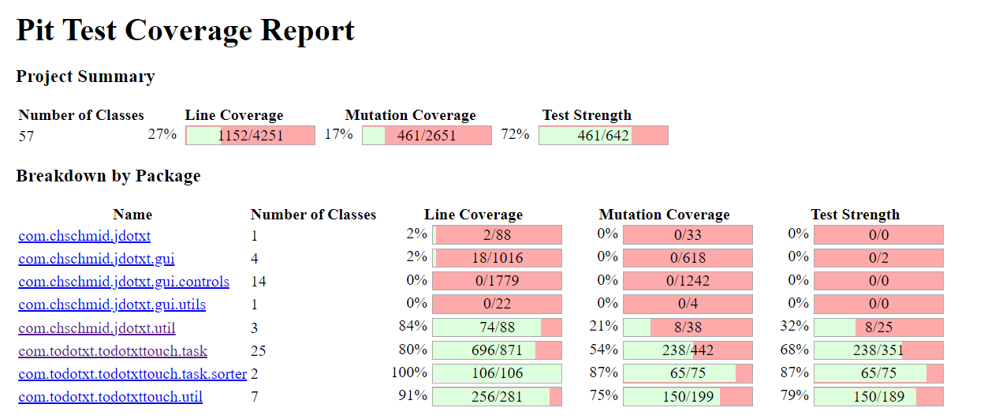
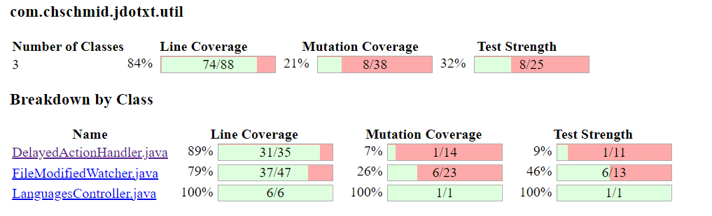
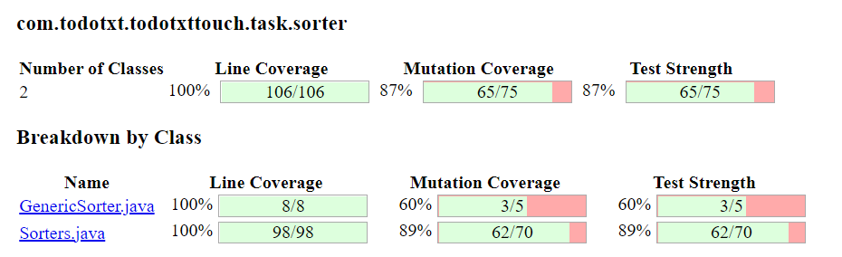
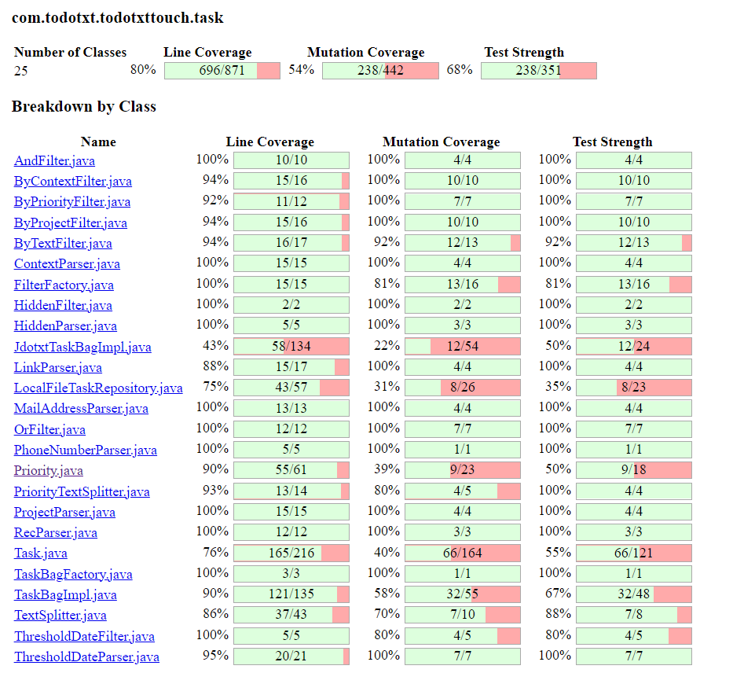
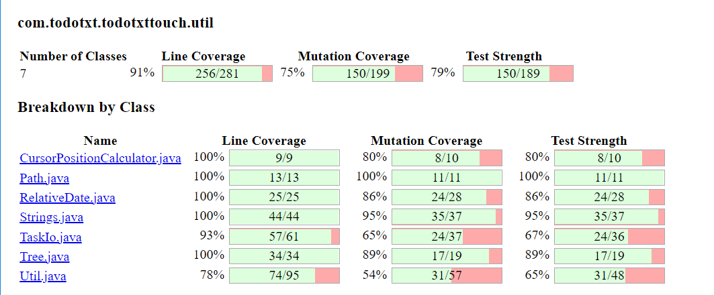

# Report - Assignment #09

> **Anastasiia Dunaeva** - up202202453
>
> **Lucas Silva** - up202103397
>
> **Francisco Pacheco** - up201906505
> 

## Mutation score of the unit tests you developed in all previous assignments
- Mutation score report by PIT library.






## Equivalent mutants
- `com.todotxt.todotxttouch.task.Task::hashCode`
    - Replaced integer multiplication with division → SURVIVED
    - ```java
      public int hashCode() {
         final int prime = 31;
		       int result = 1;
		       result = prime * result + (completed ? 1231 : 1237);
          // some code
      }
      ```
    - result will not change in we change multiplication for division because result is always 1
- `com.todotxt.todotxttouch.task.ThresholdDateFilter::apply`
    - changed conditional boundary → SURVIVED
    - ```java
        public boolean apply(Task input) {
          // some code
          return thresholdDate.getTime() <= System.currentTimeMillis();
        }
      ```
    - Situation when threshold date if input task will be equal current time in milliseconds is unreachable.
- `com.todotxt.todotxttouch.task.ByTextFilter::apply`
  - changed conditional boundary → SURVIVED
  - ```java
      if ((part.length() > 0) && !taskText.contains(part))
		      return (false);
      ```
  - If part is an empty string taskText will always contain part and !taskText.contains(part) will be false, it means that returned value will not change
- `com.todotxt.todotxttouch.task.Priority::range`
  - changed conditional boundary → SURVIVED
  - ```java
      for (Priority p : (p1.ordinal() < p2.ordinal() ? Priority.values()
				  : Priority.reverseValues())) {
            // some code
      }
      ```
  - In case p1.ordinal() == p2.ordinal() Priority.values() and Priority.reverseValues() are similar, so the resul will not change.
- `com.todotxt.todotxttouch.task.Task::getPhoneNumbers()`
  - replaced return value with Collections.emptyList → SURVIVED
    - ```java
        public List<String> getPhoneNumbers() {
          return phoneNumbers;
        }
      ```
    - PhoneNumberParser always returns empty list


## Brief description of test cases developed to increase project’s mutation score
- com.todotxt.todotxttouch.task.Priority

| Tested function                                        | Test name                  | Mutation killed                                                                       | Description                                                                  |
|--------------------------------------------------------|----------------------------|---------------------------------------------------------------------------------------|------------------------------------------------------------------------------|
| range(Priority p1, Priority p2)                        | testRangeCorrectList       | replaced return value with Collections.emptyList<br/> negated conditional -> SURVIVED | Checks every element of returned list                                        |
| range(Priority p1, Priority p2)                        | testRangeEqualBoundaries   | changed conditional boundary -> SURVIVED                                              | Checks that function works correctly in case first value equals second value |
| rangeInCode(Priority p1, Priority p2)                  | testRangeInCodeCorrectList | replaced return value with Collections.emptyList -> SURVIVED                          | Checks every element of returned list                                        |
| toPriority(List<String> codes)                         | testToPriorityCorrectList  | replaced return value with null -> SURVIVED                                           | Checks every element of returned list                                        |
| toPriority(String s)                                   | testToPriorityCorrect      | replaced return value with null -> SURVIVED                                           | Check that function returns Priority.NONE                                    |

- com.todotxt.todotxttouch.task.Task

| Tested function    | Test name            | Mutation killed                                              | Description                                                 |
|--------------------|----------------------|--------------------------------------------------------------|-------------------------------------------------------------|
| getLinks()         | testGetLinks         | replaced return value with Collections.emptyList -> SURVIVED | Checks size of returned list                                |
| getPrependedDate() | testGetPrependedDate | replaced return value with "" -> SURVIVED                    | Checks that prepended date is calculated correctly          |
| getRelativeAge()   | testGetRelativeAge   | replaced return value with "" -> SURVIVED                    | Checks that relative age is calculated correctly            |
| isRec()            | testIsRec            | replaced boolean return with false -> SURVIVED               | Check that rec property is calculated correctly             |
| isFromThreshold()  | testIsFromThreshold  | replaced boolean return with false -> SURVIVED               | Check that isFromThreshold property is calculated correctly |
| getDuration()      | testGetDuration      | replaced int return with 0 -> SURVIVED                       | Check that duration property is calculated correctly        |
| getAmount()        | testGetAmount        | replaced int return with 0 -> SURVIVED                       | Check that amount property is calculated correctly          |
